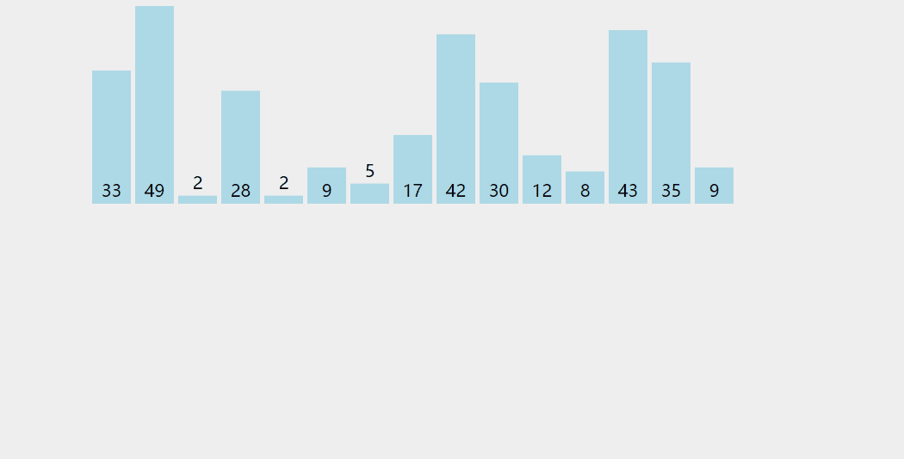

好了，今天事情很多，就直接就进入正题吧。

# 插入排序

插入排序（英语：Insertion Sort）是一种简单直观的排序算法。它的工作原理是通过构建有序序列，对于未排序数据，在已排序序列中从后向前扫描，找到相应位置并插入。插入排序在实现上，通常采用in-place排序（即只需用到O(1)的额外空间的排序），因而在从后向前扫描过程中，需要反复把已排序元素逐步向后挪位，为最新元素提供插入空间。

操作步骤：
1. 从第一个元素开始，该元素可以认为已经被排序
2. 取出下一个元素，在已经排序的元素序列中从后向前扫描
3. 如果该元素（已排序）大于新元素，将该元素移到下一位置
4. 重复步骤3，直到找到已排序的元素小于或者等于新元素的位置
5. 将新元素插入到该位置后
6. 重复步骤2~5

图示如下：




`Java` 代码如下：

```java
public static void InsertionSort(int[] a){
        int temp,N = a.length;
        //因为要和前面数比较，所以直接从第二个数开始
        for (int i = 1; i<N;i++){
        //如果发现前面有比当前位置上大的数，就交换位置
            for (int j = i; j>0&&(a[j]<a[j-1]);j--){
                temp = a[j-1];
                a[j-1] = a[j];
                a[j] = temp;
            }
        }
    }
```
