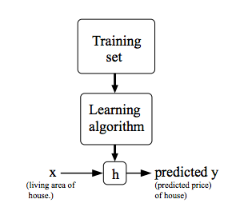

# What is the Machine Learning

A computer program is said to learn from experience E with respect to some class of tasks T and performance measure P, if its performance at tasks in T, as measured by P, improves with experience E

- Supervised Learning
- Unsupervised Learning


## Supervised Learning


In supervised learning, we are given a data set and already know what our correct output should look like, having the idea that there is a relationship between the input and the output.

Supervised learning problems are categorized into "regression" and "classification" problems. In a regression problem, we are trying to predict results within a continuous output, meaning that we are trying to map input variables to some continuous function. In a classification problem, we are instead trying to predict results in a discrete output. In other words, we are trying to map input variables into discrete categories.


##  Unsupervised Learning

Unsupervised learning allows us to approach problems with little or no idea what our results should look like. We can derive structure from data where we don't necessarily know the effect of the variables.

We can derive this structure by clustering the data based on relationships among the variables in the data.

With unsupervised learning there is no feedback based on the prediction results.


##  Model Representation




## Gradient Descent

$$\theta_j:=\theta_j-\alpha \frac {\partial}{\partial\theta_j}J(\theta_0,\theta_1) $$

At each iteration j, one should simultaneously update the parameters $\theta_1, \theta_2.....\theta_n$. Updating a specific parameter prior to calculating another one on the $j^(th)$ iteration would yield to a wrong implementation.


## Linear Algebra

### Matrices and Vectors

```octave
% The ; denotes we are going back to a new row.
A = [1, 2, 3; 4, 5, 6; 7, 8, 9; 10, 11, 12]

% Initialize a vector 
v = [1;2;3] 
A =

    1    2    3
    4    5    6
    7    8    9
   10   11   12

v =

   1
   2
   3
  
% Get the dimension of the matrix A where m = rows and n = columns
[m,n] = size(A)
m =  4
n =  3

% You could also store it this way
dim_A = size(A)
dim_A =

   4   3

% Get the dimension of the vector v 
dim_v = size(v)
dim_v =

   3   1

% Now let's index into the 2nd row 3rd column of matrix A
A_23 = A(2,3)
A_23 =  6

```

### Addition and Scalar Multiplication

```octave
% Initialize matrix A and B 
A = [1, 2, 4; 5, 3, 2]
B = [1, 3, 4; 1, 1, 1]

% Initialize constant s 
s = 2

% See how element-wise addition works
add_AB = A + B 

% See how element-wise subtraction works
sub_AB = A - B

% See how scalar multiplication works
mult_As = A * s

% Divide A by s
div_As = A / s

% What happens if we have a Matrix + scalar?
add_As = A + s
```

### Matrix Vector Multiplication

```octave
% Initialize matrix A 
A = [1, 2, 3; 4, 5, 6;7, 8, 9] 

% Initialize vector v 
v = [1; 1; 1] 

% Multiply A * v
Av = A * v

```

### Matrix Matrix  Multiplication

```octave
% Initialize a 3 by 2 matrix 
A = [1, 2; 3, 4;5, 6]

% Initialize a 2 by 1 matrix 
B = [1; 2] 

% We expect a resulting matrix of (3 by 2)*(2 by 1) = (3 by 1) 
mult_AB = A*B

A =

   1   2
   3   4
   5   6

B =

   1
   2

mult_AB =

    5
   11
   17

```

### Matrix Multiplication Properties

```octave
% Initialize random matrices A and B 
A = [1,2;4,5]
B = [1,1;0,2]

% Initialize a 2 by 2 identity matrix
I = eye(2)

% The above notation is the same as I = [1,0;0,1]

% What happens when we multiply I*A ? 
IA = I*A 

% How about A*I ? 
AI = A*I 

% Compute A*B 
AB = A*B 

% Is it equal to B*A? 
BA = B*A 

% Note that IA = AI but AB != BA

A =

   1   2
   4   5

B =

   1   1
   0   2

I =

Diagonal Matrix

   1   0
   0   1

IA =

   1   2
   4   5

AI =

   1   2
   4   5

AB =

    1    5
    4   14

BA =

    5    7
    8   10

```

### Inverse and Transpose

```octave
% Initialize matrix A 
A = [1,2,0;0,5,6;7,0,9]

% Transpose A 
A_trans = A' 

% Take the inverse of A 
A_inv = inv(A)

% What is A^(-1)*A? 
A_invA = inv(A)*A

A =

   1   2   0
   0   5   6
   7   0   9

A_trans =

   1   0   7
   2   5   0
   0   6   9

A_inv =

   0.348837  -0.139535   0.093023
   0.325581   0.069767  -0.046512
  -0.271318   0.108527   0.038760

A_invA =

   1.00000  -0.00000   0.00000
   0.00000   1.00000  -0.00000
  -0.00000   0.00000   1.00000
```

